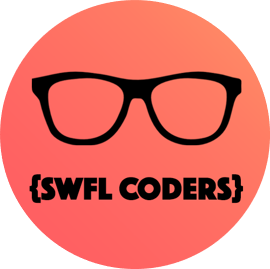
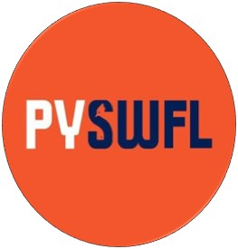

# The Art of Transpiling
A two-part lecture series that discusses the practice, methods, and applications for translating source code between languages.

## Part I. Javascript to Python and Beyond

In this talk, professional software developer Jon Boynton shares tips and strategies for rapidly learning new programming languages through the art of transpiling. In the discussion, He will demonstrate how to break down Javascript and re-write it in Python. The talk will also include a general lecture on the topic of transpiling, various transpiling tools, and a brief introduction to JSConvert – an extendable open-source transpiler written in Python.

## Part II. Introduction to JSConvert

Professional software developer Jon Boynton discusses how, after 25 years of working in Java, he decided to do a deep dive into Python 3. The result was JSConvert, an open-source transpiler written in 100% pure Python. The transpiler converts Javascript source code into Python source code. Users and third-party developers can extend JSConvert to work with other languages as well.

If you have ever wanted to re-use javascript code in a python project, or just want to amp up your Python skills, JSConvert is great for doing both. In this tutorial, Jon Boynton will explain how the program works and how developers, both experienced and novice, can extend the programs capabilities. Coding examples will be given showing how to create rules, interpret language specifications, and output translated results. The tutorial will also include several live demonstrations, use of Eclipse IDE for Python, and a broader discussion on programming in Python vs. Javascript.

## Event Location
**The Collaboratory** in downtown Ft. Myers, Florida 
**Part I:** *Javascript to Python and Beyond*, presented on July 14th, 2022 
**Part II:** *Introduction to JSConvert*, presented on July 28th, 2022 

## Event Hosts

## Speaker’s Biography

Jon Boynton is an Internet Technology Professional with over 35 years of programming experience. He began working professionally as a software developer in the late 1990’s after learning to program in the Java language.  Over the years, Boynton has also worked with BASIC, FORTRAN, Perl, C#, Javascript, Python, PHP, SQL, JSP, and ASP among others. Currently, Mr. Boynton is working with his company, Datamessenger.com, to develop distributed database technologies for IoT devices.

## About This Repository:

This repo includes PPT slides for the Art of Transpiling lecture series. Both long and short versions of each presentation are provided. Also included are source code for the sample project used to demonstrate transpiling techniques.

## Source Code Description:
This presentation uses a source code project that was specifically designed for demonstrating transpiling techniques. The code creates, and tests, a class called NumberString. Instances of the class will parse a very large number from a string and format it into words. Numbers can be formatted up to 66 digits in length (over 999 vigintillion). It should be noted that, although this code is Free and open-source, it is not optimized or intended for use in production code.
